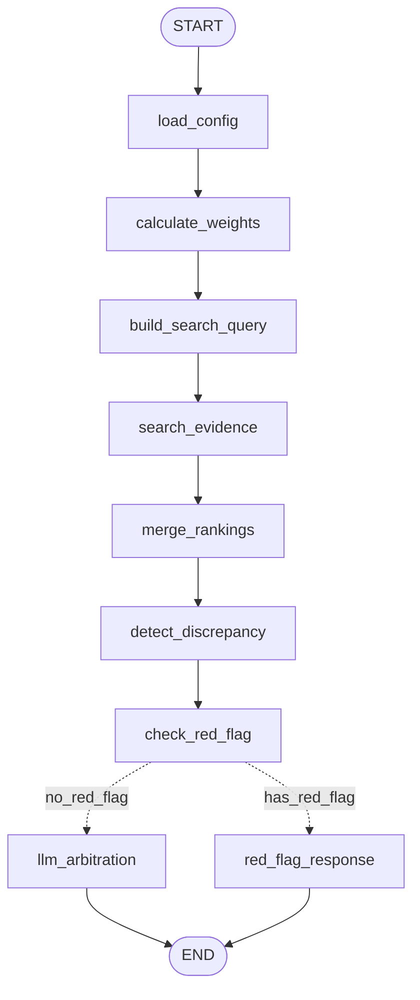

# LangGraph 버킷 추론 파이프라인

> 버전: V3.1
> 최종 업데이트: 2025-12-24

---

## 개요

LangGraph 기반 버킷 추론 파이프라인은 기존 `BucketInferencePipeline`과 동일한 기능을 제공하면서 다음 이점을 추가합니다:

| 항목 | 기존 | LangGraph |
|------|------|-----------|
| **성능** | 10.4초 | 7.1초 (-32%) |
| **상태 관리** | 수동 전달 | 자동 |
| **시각화** | 없음 | Mermaid/Studio |
| **체크포인트** | 없음 | 내장 |
| **재시도** | 수동 | 내장 |

---

## 그래프 구조



---

## 노드 상세

### 1. load_config
- **역할**: 부위별 설정 로드 (BodyPartConfigLoader)
- **입력**: `body_part_code`
- **출력**: `bp_config`, `started_at`

### 2. calculate_weights
- **역할**: 증상 코드 기반 버킷 점수 계산 (Path A)
- **입력**: `current_body_part`, `bp_config`
- **출력**: `bucket_scores`, `weight_ranking`

### 3. build_search_query
- **역할**: 벡터 검색 쿼리 구성
- **입력**: `current_body_part`, `input_data`
- **출력**: `search_query`

### 4. search_evidence
- **역할**: Pinecone 벡터 검색 수행 (Path B)
- **입력**: `search_query`, `body_part_code`
- **출력**: `evidence`, `search_ranking`

### 5. merge_rankings
- **역할**: 가중치 + 검색 랭킹 통합
- **입력**: `weight_ranking`, `search_ranking`
- **출력**: `merged_ranking`

### 6. detect_discrepancy
- **역할**: 가중치 vs 검색 불일치 감지
- **입력**: `weight_ranking`, `search_ranking`
- **출력**: `discrepancy`, `has_discrepancy`

### 7. check_red_flag
- **역할**: Red Flag 체크
- **입력**: `current_body_part`, `bp_config`
- **출력**: `red_flag`, `has_red_flag`
- **분기**: `has_red_flag` → `red_flag_response` | `llm_arbitration`

### 8. llm_arbitration
- **역할**: LLM 최종 버킷 결정
- **입력**: 모든 이전 상태
- **출력**: `final_result`

### 9. red_flag_response
- **역할**: Red Flag 경고 응답 생성
- **입력**: `bucket_scores`, `weight_ranking`, `red_flag`
- **출력**: `final_result`

---

## 상태 (State) 스키마

```python
class BucketInferenceState(TypedDict):
    # === 입력 ===
    input_data: BucketInferenceInput
    current_body_part: BodyPartInput
    body_part_code: str

    # === 설정 ===
    bp_config: Optional[BodyPartConfig]

    # === 중간 결과 ===
    bucket_scores: Optional[List[BucketScore]]
    weight_ranking: Optional[List[str]]
    search_query: Optional[str]
    evidence: Optional[EvidenceResult]
    search_ranking: Optional[List[str]]
    merged_ranking: Optional[List[str]]

    # === 분석 결과 ===
    discrepancy: Optional[DiscrepancyAlert]
    red_flag: Optional[RedFlagResult]
    has_red_flag: bool
    has_discrepancy: bool

    # === 출력 ===
    final_result: Optional[BucketInferenceOutput]
    error: Optional[str]

    # === 메타데이터 ===
    started_at: Optional[datetime]
    completed_at: Optional[datetime]
```

---

## 사용법

### 기본 사용

```python
from bucket_inference.pipeline import LangGraphBucketInferencePipeline

pipeline = LangGraphBucketInferencePipeline()
results = pipeline.run(input_data)
```

### 체크포인트 사용

```python
# 상태 저장/재시도 활성화
pipeline = LangGraphBucketInferencePipeline(use_checkpointer=True)
results = pipeline.run(input_data)
```

### 그래프 시각화

```python
# Mermaid 형식
print(pipeline.get_graph_visualization())
```

### Gateway에서 사용

```python
from gateway.services.orchestrator import OrchestrationService

# LangGraph 사용 (기본값)
service = OrchestrationService()
print(service.bucket_pipeline_type)  # "langgraph"

# 기존 파이프라인 사용
service = OrchestrationService(use_langgraph_bucket=False)
print(service.bucket_pipeline_type)  # "original"
```

### 환경변수 설정

```bash
# 기존 파이프라인으로 폴백
USE_LANGGRAPH_BUCKET=false
```

---

## 파이프라인 비교

```python
from bucket_inference.pipeline import compare_pipelines

result = compare_pipelines(input_data)
print(result["comparison"])
# {
#     "knee": {
#         "bucket_match": True,
#         "confidence_diff": 0.0,
#         "original_bucket": "OA",
#         "langgraph_bucket": "OA"
#     }
# }
```

---

## 파일 위치

| 파일 | 설명 |
|------|------|
| `bucket_inference/pipeline/langgraph_pipeline.py` | LangGraph 파이프라인 |
| `bucket_inference/pipeline/inference_pipeline.py` | 기존 파이프라인 |
| `gateway/services/orchestrator.py` | 파이프라인 선택 로직 |

---

## 향후 확장

### Exercise Recommendation LangGraph
- 현재: 기존 파이프라인 유지
- 조건: 스트리밍 필요 시 전환 검토

### Gateway 전체 LangGraph
- 현재: 기존 OrchestrationService 유지
- 조건: Human-in-the-loop 필요 시 전환 검토
